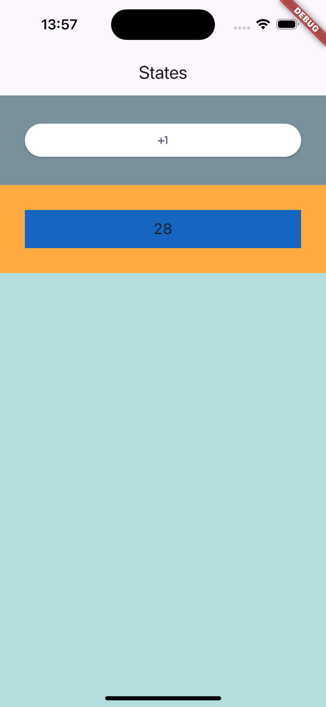

# Flutter State Test

In this app, there are several widgets building two nested widgets.

## First exercise
The '+' button should increase the number held by the nested widget beneath. The conditions to be met are:

1.  You can only change/have 1 new StatefulWidget in the project (i.e., convert one Stateless widget to Stateful).

2.  You can add as many variables/constants, constructors, and parameters/arguments as you need.

3.  You can only add one new function (if you need more, you must justify it).

4.  You cannot create new classes that inherit from StatefulWidget or StatelessWidget (of course, when changing to a StatefulWidget, you can have its associated State class).

5.  YOU CANNOT USE ANY PACKAGES.

## Second exercise
Add another button "-" that every time is tapped, it subtracts 1 to the counter. Note that the value should never be below 0.
 
